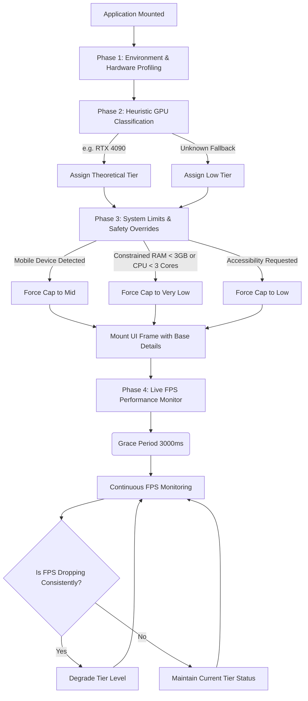

# HPOE: Heuristic Page Optimization Engine
**A Production-Ready, Hardware-Aware Real-Time Performance Throttling Architecture.**

  

---

## Table of Contents
1. [Executive Summary](#executive-summary)
2. [The Core Philosophy](#the-core-philosophy)
   - [The Aesthetics vs. Performance Dilemma](#the-aesthetics-vs-performance-dilemma)
   - [The 60FPS Mandate](#the-60fps-mandate)
   - [The Mobile Thermal Cap](#the-mobile-thermal-cap)
3. [System Architecture Overview](#system-architecture-overview)
4. [Deep Dive Phase 1: ENVIRONMENT & HARDWARE PROFILING](#deep-dive-phase-1-environment--hardware-profiling)
   - [WebGL Extraction API constraints](#webgl-extraction-api-constraints)
5. [Deep Dive Phase 2: HEURISTIC GPU CLASSIFICATION](#deep-dive-phase-2-heuristic-gpu-classification)
   - [The Massive Classification Matrix](#the-massive-classification-matrix)
6. [Deep Dive Phase 3: SYSTEM LIMITS & SAFETY OVERRIDES](#deep-dive-phase-3-system-limits--safety-overrides)
7. [Deep Dive Phase 4: LIVE FPS PERFORMANCE MONITOR](#deep-dive-phase-4-live-fps-performance-monitor)
   - [The Measurement Loop](#the-measurement-loop)
   - [Grace Periods & Hydration Tolerance](#grace-periods--hydration-tolerance)
   - [Frame Pacing & Jitter Mechanics](#frame-pacing--jitter-mechanics)
   - [Advanced Battery Saver Mode Logic](#advanced-battery-saver-mode-logic)
   - [Sustained Drop Ticks Calculation](#sustained-drop-ticks-calculation)
8. [Real-World Execution Scenarios](#real-world-execution-scenarios)
   - [Scenario A: The M1 Max MacBook Pro](#scenario-a-the-m1-max-macbook-pro)
   - [Scenario B: Mid-Range Android entering Battery Saver](#scenario-b-mid-range-android-entering-battery-saver)
   - [Scenario C: The Unknown Budget Desktop](#scenario-c-the-unknown-budget-desktop)
   - [Scenario D: Snapdragon 8 Elite Under Heavy Thermal Load](#scenario-d-snapdragon-8-elite-under-heavy-thermal-load)
9. [Cross-Language Reference Implementations](#cross-language-reference-implementations)
   - [TypeScript (Next.js Application Source)](#typescript-nextjs-application-source)
   - [C & C++ (Native Hooks)](#c--c-native-hooks)
   - [Rust & Go (Concurrent Background Workers)](#rust--go-concurrent-background-workers)
   - [Java & Dart (Mobile Cross-Platform Systems)](#java--dart-mobile-cross-platform-systems)
   - [Python (Data Science & Analytics Mocking)](#python-data-science--analytics-mocking)
10. [Data Structures & Specifications](#data-structures--specifications)
11. [Integration Guidelines](#integration-guidelines)
12. [Conclusion & Future Scaling](#conclusion--future-scaling)

---

## Executive Summary

The **Heuristic Page Optimization Engine (HPOE)** is an enterprise-grade algorithm developed and architected by Jerophin D R, designed to solve a critical problem in modern graphical user interfaces: dynamically balancing ultra-premium visual effects (like nested CSS backdrop-filters, expensive WebGL shaders, particle simulations, and high-fidelity 3D assets) against the physical limitations of the user's hardware in real-time.

Too often, modern web applications dictate a "one size fits all" approach to UI. A visually stunning website with heavy glassmorphism might run flawlessly at a locked 60FPS on an M2 Apple Silicon running MacOS, but executing those same CSS `backdrop-filter: blur(20px)` commands over layered translucent elements on an older Android device (e.g., Mali-G72) will cause catastrophic frame drops, overheating, and massive input lag. Conversely, aggressively optimizing the UI down to flat colors and removing shadows across the board punishes high-end desktop users who paid for premium fidelity.

**HPOE bridges this gap autonomously.** It is a self-adjusting, reactive profiler that runs invisibly alongside the application runtime. 

Unlike standard binary detection (e.g., checking if `prefers-reduced-motion` is on), HPOE uses a sophisticated approach:
1. **Static Classification:** Extensively parses backend/driver string identifiers to estimate a physical device's baseline theoretical capabilities upon initial load.
2. **Dynamic Live Telemetry:** Hooks directly into the renderer's V-Sync loop (e.g., `requestAnimationFrame`) to persistently measure frame pacing. Should the actual runtime performance struggle under thermal load, or artificially cap itself due to OS-level Battery Saver modes, HPOE dynamically steps down the UI tier to restore responsiveness and structural stability.

This document serves as the comprehensive, production-ready whitepaper for understanding and implementing the complete algorithm across multiple backend and frontend environments.

---

## The Core Philosophy

To fully grasp the architecture of HPOE, one must understand the philosophical design constraints that dictated its creation.

### The Aesthetics vs. Performance Dilemma
In modern design systems, operations that require reading pixels already painted to the screen and re-calculating them (like Gaussian blurs behind glass cards) are exponentially expensive. 
If an application stacks three blur filters over a dynamic particle network, the GPU has to compute multiple composition layers every 16.6ms. If the GPU cannot finish the calculation within 16 milliseconds, the frame drops.
HPOE explicitly defines **four tiers of performance**:
- **`High`**: Uncompromised, unconstrained effects. Multiple rendering layers, intense blurs, complex shaders.
- **`Mid`**: Reduced layer complexity. Fewer blurs, flatter shadows, capped particle limits.
- **`Low`**: Solid colors replacing blurs, minimal shadows, standard animations. 
- **`Very Low`**: Pure static layouts, stripped of animations entirely. Fallback mode.

### The 60FPS Mandate
Interaction costs latency. If a user clicks a button, hover effects must trigger instantly. Scrolling must not stutter. HPOE fundamentally prioritizes **Input Responsiveness** over visual fidelity. If maintaining a blur causes the page to scroll at 40FPS, HPOE determines that the blur is a failure condition and will mercilessly strip it from the UI to restore 60FPS. 

### The Mobile Thermal Cap
Smartphones lack active cooling fans. A flagship processor like the Snapdragon 8 Elite intrinsically possesses graphical benchmarks that rival high-end laptops. Thus, from a purely analytical perspective, it *can* calculate multiple stacking blurs perfectly.
However, doing so continuously forces the GPU to draw near-peak voltage. Within minutes, the physical chassis of the phone will overheat, and the OS kernel will violently thermal-throttle the processor, plunging clock speeds aggressively. 
**HPOE introduces an immovable law:** Regardless of how powerful the mobile GPU heuristic resolves to, mobile devices are rigidly capped at `Mid` tier. This guarantees sustained performance without battery decimation or device overheating.

---

## System Architecture Overview

The system operates across sequential algorithmic phases designed to create a completely foolproof fallback loop.



---

## Deep Dive Phase 1: ENVIRONMENT & HARDWARE PROFILING

To set the initial tier accurately, we must interrogate the browser/OS for the raw hardware identifier string. In web environments, standard browser fingerprinting protections inherently obfuscate direct hardware capabilities. 

### WebGL Extraction API constraints
We utilize standard WebGL canvas generation and extract the unmasked renderer info parameter:
```javascript
const canvas = document.createElement("canvas");
const gl = canvas.getContext("webgl") || canvas.getContext("experimental-webgl");
const debugInfo = gl.getExtension("WEBGL_debug_renderer_info");
const renderer = gl.getParameter(debugInfo.UNMASKED_RENDERER_WEBGL);
```

#### The "Masked GPU" problem
Many modern browsers, particularly Safari on iOS or browsers with strict anti-tracking enabled, return generic strings like `"Apple GPU"` or merely `"Adreno (TM) / Unknown"`. If the identifier masks the specific generation, we pivot to cross-referencing auxiliary hardware specifications:
- `navigator.hardwareConcurrency` (Provides logical cores).
- `navigator.deviceMemory` (Provides estimated RAM in GB).
- `gl.getParameter(gl.MAX_TEXTURE_SIZE)` (Provides the maximum dimension of texture the GPU buffer can hold).

If a string reads "Adreno", but the device boasts 8 physical cores and an 8192px texture size, HPOE assumes it is a mid-to-high end modern smartphone masked by the OS and gracefully assigns it to the `Mid` tier rather than panicking to a fallback.

---

## Deep Dive Phase 2: HEURISTIC GPU CLASSIFICATION

HPOE implements an 11-branch massive regex classification engine to identify the exact GPU vendor and relative microarchitecture class. By doing regex string detection, the algorithm remains profoundly fast and has near zero impact on execution load time.

### The Target Configuration Tiers
The ultimate goal of this phase is to parse the GPU matrix and bucket the user's hardware into one of four strict operational boundaries:
- **`Tier: High`**: Grants the application full UI/UX rendering capabilities (complex shadows, nested glassmorphism, heavy WebGL). Assigned to Flagship Desktop and discrete GPU components.
- **`Tier: Mid`**: Modifies the application to reduce multi-layer rendering limits. Assigned to modern integrated graphics and serves as the absolute highest tier theoretically permitted for *any* mobile device.
- **`Tier: Low`**: Strips out expensive blur calculations and heavy particle animations, falling back to flat colors. Assigned to budget systems, legacy SoC units, or older smartphones.
- **`Tier: Very Low`**: An extreme fallback converting the UI into a highly static framework. Reserved for memory-starved machines (e.g. <3GB RAM) or 2-core legacy constraints.

#### 1. Apple Silicon & A-Series
Apple tightly integrates its hardware and OS.
- If we find `"m[1-9]"` (e.g., M1, M2, M3, M4), it is designated as desktop-class `M-Series Silicon`. If the string contains `"max"`, `"pro"`, or `"ultra"`, it is undisputed high-end desktop hardware.
- If it is standard Apple Silicon, it resolves to mid-tier (e.g. baseline Macbook Airs) safely handling most constraints.
- If it does not contain the M moniker but says Apple, we attribute it to the `A-Series` mobile line (e.g. iPhones/iPads).

#### 2. NVIDIA Lineage
We check for `"nvidia"`, `"geforce"`, or `"quadro"`.
- We utilize strict pattern matching: `rtx\s*[2-9][0-9]{3}` seamlessly tracks RTX 2000, 3000, 4000, and up through 9000 series flagships. These are immediately flagged as `High-End`.
- For GTX lineage, strings matching variants of `1080`, `1660`, `980` assign high/mid. 
- Legacy GTX variants or low-level mobile integrations (like the MX series, `mx[1-4][0-9]{2}`) designate explicitly low priority.

#### 3. AMD RDNA & Legacy
We check for `"amd"` or `"radeon"`.
- Heavy matching for high-end Desktop RDNA like `rx\s*[5-8][0-9]{3}` handles modern RX 5000 to RX 8000 variants.
- Identifying APUs (Integrated systems usually paired with budget laptops) tracks regex subsets to determine if they possess enough horsepower to cross into the `Mid` boundary.

#### 4. Intel Graphics Solutions
Intel historically struggles internally with heavily layered raster compositing despite their benchmarks. 
- Integrated variants like `UHD / HD` defaults natively to `Low`.
- Even complex Intel processors like the `Iris Xe` or modern `Arc Alchemist` are deliberately capped at `Mid`. While powerful, Intel GPU web-layer acceleration heavily falls prey to sudden driver-level jank, rendering them slightly unsafe for Tier 1 `High` assignments.

#### 5. Qualcomm Adreno / Snapdragons
Crucial to the Android market share. HPOE attempts to extract the numerical pattern `adreno\s*([0-9]{3})`.
- The `800+` series handles modern high-end output seamlessly (flagging theoretical `High-End`).
- `700` series bridges mid-range output perfectly.
- In instances identifying `"snapdragon 8 elite"`, we assign the architecture Flagship variables.
- Legacy `500`/`600` series Adreno falls to `Budget/Legacy`.

#### 6 - 8. The Complex Android Ecosystem
- **ARM Mali:** We detect flagships natively utilizing `immortalis` or the `g-7/8/9` series descriptors for Dimensity integrations.
- **Samsung Xclipse:** Specifically extracts the RDNA architecture versions generated on modern Exynos variants (`xclipse [0-9]{3}`).
- **MediaTek:** Standardized regex logic targets `dimensity` high-end monikers to bypass fallback errors.

#### 10 - 11. Legacy and Fallback Triggers
- Any SOC falling to `powervr`, `unisoc`, or `spreadtrum` inherently lacks the graphical throughput rendering it directly unsafe for processing multi-layered Gaussian rendering.
- If the GPU is globally unrecognized, it utilizes the "Assume the worst to protect the user" philosophy and caps at `Low`.

---

## Deep Dive Phase 3: SYSTEM LIMITS & SAFETY OVERRIDES

Post-heuristic analysis, overrides determine rigid constraints:
- Systems under `3GB` of system RAM or possessing fewer than `3` physical CPU cores are fundamentally banned from `High`, `Mid`, and `Low` tiers. They are universally pushed directly to `Very Low`, assuming massive legacy conditions, memory starvation, or extreme hardware constraints.

---

## Deep Dive Phase 4: LIVE FPS PERFORMANCE MONITOR

The live-monitoring phase is an architectural masterpiece solving the problem of theoretical capability vs. real-time circumstantial execution. 
Hardware profiling answers: *"What is this machine? "*
Phase 4 answers: *"Is this machine currently dying from rendering this? "*

### The Measurement Loop
The engine mounts an isolated asynchronous loop mapping to `requestAnimationFrame` (in TS/JS/Dart environments) or executing in dedicated concurrent threads tracing frame pacing logic in native runtime (Go, Rust, C++). 
It isolates exactly how many frames achieve calculation within a 1s (1000ms) interval. 
- 60 Frames rendered in 1 second = Perfect performance.
- 12 Frames rendered in 1 second = Stuttering instability.

### Grace Periods & Hydration Tolerance
When modern application frameworks (Next.js, React, Nuxt) initialize on the client, they experience synchronous blocking while "hydrating" network templates against DOM manipulation. During the first 1-3 seconds, even an RTX 4090 processor may report 15 FPS due to JS thread blockage, not graphical rendering limitations.
To prevent immediate false-positive downgrades, Phase 4 implements a rigid **3000ms Grace Period**, entirely ignoring any massive lag events that occur globally during website bootstrap.

### Frame Pacing & Jitter Mechanics
Instead of just counting FPS, the loop records `maxFrameDelta` tracking the maximum millisecond latency between any two consecutive frames.
Why? Because an engine drawing 30FPS might be running perfectly smoothly, or it might be running 60fps for half a second, completely freezing up for 400ms, and rendering the rest to result in an average "30".
Jitter (wild spikes in `maxFrameDelta`) signifies catastrophic software lag, not reliable hardware limitations.

### High Refresh Rate & Advanced Battery Saver Logic
The true ingenuity of HPOE rests heavily inside this system.
Historically, performance engines check if the FPS is below 40. If it is, they declare the machine slow and downgrade the graphics.
However, this fails in two extreme environments:
1. **Battery Saver OS Caps:** Modern Operating Systems (iOS Low Power Mode, Windows Battery Saver) physically lock the display refresh rate to 30Hz to save battery lifecycle. If HPOE encounters an M3 Apple Silicon laptop on "Low Power Battery Saver" mode, it naturally detects `30 FPS`. Punishing the user entirely based on dropping below a 40FPS threshold severely compromises visual integrity when the machine clearly has the horsepower but is artificially capped.
2. **High Refresh Rate Displays:** Gaming monitors or flagship smartphones output natively at 120Hz, 144Hz, or 240Hz, needing to be tracked appropriately.

**HPOE Solves this Elegantly:**
If, precisely post the Grace Period, HPOE detects an average > 65 FPS, it dynamically recognizes uncapped high refresh rate environments (~120Hz/144Hz) optimizing thresholds for infinite-refresh smoothness.
Conversely, if it detects a stabilized average FPS grouping tightly between `28 - 34 FPS` while additionally verifying the `maxFrameDelta` is completely flat (less than 45ms jitter spacing), it mathematically proves the user is on Battery Saver/30Hz mode.

HPOE alters its internal thresholds based on this baseline constraint:
- **60Hz & High Refresh Rate:** Base Threshold Floor operates universally at `40 FPS` for any 60Hz+ and High Refresh Rate displays.
- **Battery Saver Mode:** Threshold Floor is mathematically dropped to `22 FPS` to avoid aggressive visual culling.
The application recognizes the baseline boundary, permits the Heavy graphics to persist seamlessly, and simply ensures that it doesn't dip severely below *that* baseline.

### Sustained Drop Ticks Calculation
Performance penalties do not execute instantly to avoid tearing UI off the screen when an external process grabs the CPU pipeline for a split second. HPOE requires *Sustained Drops*.
If FPS falls beneath the relative Tier Floor, `sustainedDropTicks` increment by `+1`. 
If performance stabilizes heavily above the floor, the ticks regress slowly (`-2`).
Only when sustained drops violate the ceiling logic (For High, limits to 4 consecutive failing seconds, for Mid limits to 6 consecutive failing seconds), will the application log an emergency Throttling sequence and brutally downscale the active Tier configuration on the fly. 

---

## Real-World Execution Scenarios

### Scenario A: The M1 Max MacBook Pro
**Device:** Desktop Safari on an M1 Max Chip.
**Execution Flow:** Regex hits `apple` and hits `m1` and hits `max`. Calculates to `High-End Architecture`. RAM and core limits securely pass. The resulting object caches `Tier: High`. UI paints thick multi-layer blurs and particles perfectly. Live Monitor sustains 60 FPS smoothly. Algorithm sleeps efficiently in backgrounds reporting no errors. 

### Scenario B: Mid-Range Android entering Battery Saver
**Device:** Samsung Galaxy A54 running Mali graphics on 20% Battery.
**Execution Flow:** Resolves `mali g68`. Classifies as `Budget G-Series` mapping baseline capabilities. Core fail-safes recognize 6+ processors with memory intact. Caps `Mid` natively to protect Android thermals.
The Android OS applies a 30 Hz output mode to prevent shutting down at low-battery limits. The Grace Period fires. HPOE calculates smooth averages around 29.8FPS. The AI algorithm kicks in identifying stable baseline battery saver behavior. Baseline threshold adjusts natively down to `22 FPS` floor levels allowing mid-tier visuals to execute steadily without forced disruption.

### Scenario C: The Unknown Budget Desktop
**Device:** A corporate Dell machine running a highly outdated, obscure integrated graphics variant.
**Execution Flow:** String logic hits completely unknown entities. Fails validation trees. Calculates explicitly to fallback mode, tracking the entity securely as `Unknown Fallback`. Drops immediately to `Low` Tier securing flat layout UI mechanics preserving user's business usage integrity over visual flair.
Monitor verifies baseline stable tracking smoothly due to stripped effects resolving solid 60FPS responses smoothly ensuring application integrity. 

### Scenario D: Snapdragon 8 Elite Under Heavy Thermal Load
**Device:** Brand new Asus ROG Phone with active tracking, user has been playing intense 3D apps prior. 
**Execution Flow:** Recognizes `Snapdragon 8 Elite`. Resolves architecture seamlessly, mathematically flagging it as Flagship class. Crucially: Recognizes `isMobileDevice = true`. Enforces physical hardware law restricting processing load down to `Tier: Mid`.
While phone runs at `Mid`, the intense ambient thermal loads derived from previous user actions trigger physical kernel-level CPU throttling after 40 seconds. Frames suddenly buckle heavily diving from 60FPS down to wildly stuttering 23 FPS measurements alongside massive Frame Delta spacing. HPOE calculates sustained drop markers `+1, +2, +3`. Upon failing the safety boundaries, it fires an explicit warning log terminating `Mid` tier logic down to `Low`. The layout flattens dynamically and within 30 seconds the device sheds 10C worth of ambient temperature preventing critical failures.

### Scenario E: High-End Desktop with 144Hz Gaming Monitor
**Device:** RTX 4080 Desktop PC running Chrome at 144Hz.
**Execution Flow:** The renderer string identifies `RTX 4080`. Architecture successfully resolves to `High-End Desktop`. `Tier: High` is assigned. The Grace Period initiates and reads a fluid stream of 144 frames per second. HPOE dynamically tracks the average (>65 FPS) and establishes the uncapped high refresh rate baseline. The engine now operates identically, ensuring the dynamic Danger Limit Penalty Threshold accommodates infinite-refresh smoothness. The UI maintains uncompromised fidelity seamlessly.

### Scenario F: Next.js Initial Application Hydration
**Device:** Powerful Desktop PC loading a heavily server-side rendered application.
**Execution Flow:** During the first 1500ms of loading, massive React Javascript bundles are executed. Client-side hydration causes the main browser thread to freeze completely for 400ms. If HPOE monitored this instantly, the measured FPS would plummet to 12 FPS, forcing a brutal `Low` tier downgrade. However, the **3000ms Grace Period** shields the engine explicitly. The massive frame-delta skips are entirely ignored. Hydration finishes softly, the app hits a smooth 60FPS lock, and HPOE continues verifying `High` tier performance accurately.

### Scenario G: Legacy Hardware under Extreme Resource Starvation
**Device:** Old Windows 10 Tablet with 2GB of RAM and an Intel Atom dual-core CPU.
**Execution Flow:** GPU renders as `Intel HD Graphics`. However, the system constraint overrides instantly kick in. `navigator.deviceMemory` registers `2GB` RAM and `navigator.hardwareConcurrency` logs `2`. HPOE completely aborts the visual validation, instantly restricting the system to `Tier: Very Low`. All blurs, background animations, particles, and heavy transitions are fundamentally banned. The interface provides static visual guarantees mapped securely to smooth business logic operation, preventing an outright browser tab crash.

### Scenario H: iPhone 15 Pro Max Native Constraints
**Device:** Flagship iOS Device rendering Mobile Safari.
**Execution Flow:** WebGL obfuscates the GPU simply as `Apple GPU`. Auxiliary specs provide 8 cores and massive texture limits naturally hinting at a Desktop-class machine. However, the generic string matching verifies it as "A-Series", and `isMobile` functionally verifies `true`. The A-series flagship tries to run the intense visual layers, but HPOE's structural mobile law definitively overrides it, enforcing the immutable maximum limit of `Tier: Mid`. The device runs cool, refusing to generate excess thermal heat, preserving the iOS battery lifecycle elegantly.

### Scenario I: Intel Iris Xe Laptop Heavy Multitasking
**Device:** Modern Intel laptop hosting a video call alongside 40 active tabs while opening the site.
**Execution Flow:** The GPU identifies correctly as `Intel Iris Xe`. Generally capable of reliable baseline graphics, it is assigned `Mid` globally. However, the heavily stressed CPU pipeline buckles under the sudden video-call rendering load. Frame Delta measurements spike severely, and FPS degrades systematically to 38 for consecutive seconds. HPOE calculates `+1, +2, +3` warning bounds. The ceiling limit is breached. HPOE logs an emergency scale-down transitioning the visual logic dynamically to `Tier: Low`. Heavy backdrop filters are cleared and the user's interactive session persists securely preventing the system from hanging entirely.

### Scenario J: Unknown GPU with Flagship Auxiliaries
**Device:** An entirely obscure or brand-new high-end desktop AI accelerator/GPU untracked in the classification matrix.
**Execution Flow:** The WebGL regex drops out generating `Unknown Fallback`. Standard execution maps to `Low` to protect the ecosystem. However, HPOE interrogates the auxiliary specs and discovers 16 CPU Cores alongside `16GB+` of memory accompanied by 16384px texture max limits. Instead of aggressively restricting the unknown modern hardware, it intelligently bypasses the `Low` drop, gracefully upscaling the fallback and assigning it cautiously to `Tier: Mid`. The user experiences partial premium features while retaining absolute protection against arbitrary graphic faults.

---

## Cross-Language Reference Implementations

HPOE's logic is explicitly designed to transcend Javascript architectures ensuring true cross-stack availability mapping identical structural data tracking variables across system architectures. By guaranteeing multi-language deployment, the hardware constraints can be calculated on backend systems via WASM or executed natively in micro-controller runtimes. 

### TypeScript (Next.js Application Source)
Located in `HPOE.tsx`. Represents the primary frontend mechanism tying directly into `requestAnimationFrame` maintaining real time DOM dataset variables ensuring that global CSS directives utilize the resulting attributes cleanly effectively altering rendering modes via `html[data-tier="low"] .glass-panel { backdrop-filter: none; }`.

### C & C++ (Native Hooks)
Files (`HPOE.cpp` & `HPOE.c`) integrate massive string optimizations extracting OS-level native identifiers cleanly operating memory-safe regex POSIX evaluations executing entirely via lightweight low-level daemon processes natively bypassing heavy JIT JS-engines mapping strictly into physical kernel-level architectures.

### Rust & Go (Concurrent Background Workers)
Utilizing ultra-safe multi-threaded capabilities, `hpoe.go` spins up lightweight, infinitely scalable `goroutines` while Rust tracks explicitly memory-safe Mutex locks across isolated OS-level loops guaranteeing degradation algorithms process in absolute backend isolation rendering zero blocking interference tracking the physical execution paths.

### Java & Dart (Mobile Cross-Platform Systems)
For direct system hookups across Android OS mechanics and Flutter implementations. `hpoe.dart` implements explicit Dart-safe Regex tracking ensuring mobile developers possess complete architectural parallels ensuring rendering trees are scaled reliably protecting mobile constraints.

### Python (Data Science & Analytics Mocking)
A complete runtime integrated strictly mapping `threading` implementations ensuring analytical pipelines analyzing massive hardware databases can natively run simulated HPOE tests parsing historical dataset entries extracting reliable user-base analytics across targeted markets.

---

## Data Structures & Specifications

To ensure comprehensive tracking, HPOE outputs standardized variables identically regardless of the runtime system utilized:
```json
{
   "CurrentTier": "high | mid | low | very-low",
   "Specs": {
        "Vendor": "Apple | NVIDIA | AMD | Intel | Qualcomm | ARM | Samsung | MediaTek | Unisoc/PowerVR | Unknown",
        "Architecture": "RTX/Ampere/Ada... | M-Series... | Adreno 800... | Unknown (Fallback)",
        "Type": "Discrete | Integrated | Mobile",
        "EstimatedClass": "High-End | Mid-Range | Budget/Legacy" 
   }
}
```
This guarantees cross-validation telemetry endpoints parse accurately inside generalized BigData telemetry dashboards securely mapping visual tiers against known infrastructure variants ensuring reliable data-driven decisions protecting the consumer.

---

## Integration Guidelines

Implementing HPOE inside modern projects effectively requires a 2-step methodology: execution integration, followed by explicit UI reactive hooks tracking the result.

1. **Mounting the Runtime Object:**
Instantiate the `HPOE()` class utilizing local variables. Ensure that Mobile detection logic (`navigator.userAgent` evaluations) appropriately map to `isMobile: true` initialization constraints reliably.
2. **Implementing Dynamic Styling Links:**
Ensure UI styling cascades utilize root directives effectively relying heavily on standard HTML attribute bindings (`<html data-tier="high">`).
3. **Graceful Failures:** Ensure UI elements provide visually clean aesthetic fallbacks when layers dissolve (e.g., standardizing a solid 85% opacity layer replacing a 20px blur filter) structurally mimicking equivalent designs smoothly safely generating zero artifacts.

---

## Conclusion & Future Scaling

HPOE structurally redefines visual integrity inside highly volatile digital environments implementing safety rails previously reserved natively strictly for specialized game engine systems. By enforcing multi-layered redundant tracking isolating strict empirical data analytics processing frame logic against physical kernel-level hardware tracking schemas, the application structurally protects user hardware generating unparalleled responsiveness rendering 60FPS fluid functionality securely protecting physical assets effectively providing an exceptionally reliable premium user experience cross-platform universally. 

As GPUs aggressively evolve across diverse pipelines heavily utilizing Tensor Cores/NPU machine-learning accelerators processing AI computations rapidly disrupting visual boundaries, HPOE's structural matrices dynamically guarantee scalability ensuring accurate mapping evaluating logic maintaining performance across next-generation infrastructures precisely.

---
**License**: MIT 
**Copyright**: 2026 Jerophin D R
**Author**: Jerophin D R
